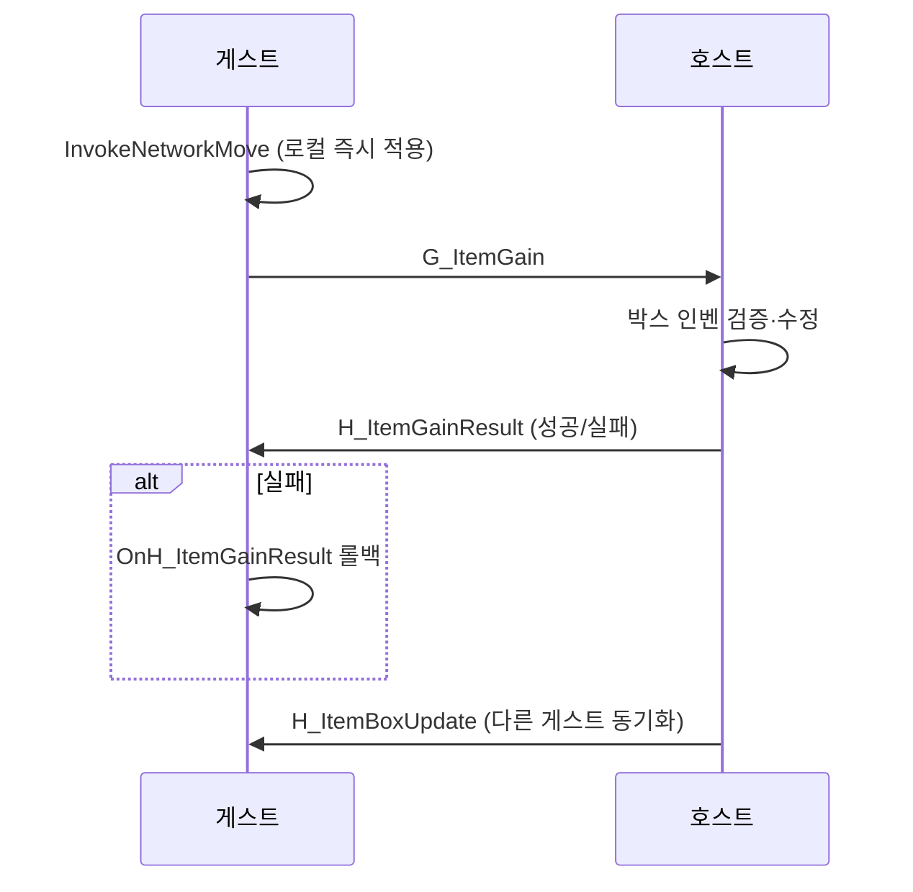

# 인벤토리·아이템 교환 규칙

플레이어 인벤토리, 창고, 아이템 박스, 장비 슬롯 간 드래그&드롭 규칙과 데이터 모델.

관련 코드: `Inventory.cs`, `SlotInteractionManager`, `UI/Inventory/MouseHandler/*`, `WorldEquipmentManager`

---

## 인벤토리 기본 (`Inventory`)

슬롯 그리드가 아니라 **평탄한 `List<ItemSlot>`**(인덱스 = 슬롯 번호), `Awake()`에서 절대 최대치(`_maxCapacity`, 기본 50)만큼 미리 할당한다.

| 개념 | 설명 |
|------|------|
| `_currentCapacity` | 실제 사용 가능 슬롯 수 (기본 20, 가방 장착으로 확장) |
| `_maxCapacity` | 절대 상한 (기본 50). 이 이상은 `SetCapacity()` 재호출 필요 |
| `ItemSlot` / `BoxItemSlot` | 플레이어 vs 박스(공개 연출용 `isOpen`/`skipReveal` 플래그) 슬롯 타입 |
| `_uid` | 스택 불가 아이템(무기·방어구 등) 인스턴스 식별자. `0`이면 스택형 소모품 |
| `CanAddItem` | **아이템 ID** 기준 스택 가능 여부 판단, 첫 빈 슬롯부터 채움 |
| `ChangeInventory` | UI 갱신 이벤트 |

**무게 제한(`MaxWeight`)은 표시만 되고 `AddItem`/`CanAddItem` 내부에서 실제로 강제되지 않는다** — 슬롯 수만 아이템 추가를 막는다.
`ReduceCapacity`(가방 해제 등)로 사용 슬롯 수가 줄 때 빈 슬롯이 부족하면 넘친 아이템이 접근 불가 상태로 남을 수 있다(코드 내 주석으로 인지된 엣지 케이스).

## 아이템 인스턴스 데이터 모델

- 정적 정의: `ItemData`(`item.csv`) — `id, name, type, effect_type, effect_value, max_stack, weight, icon, prefab` 등
- 런타임 슬롯: `ItemSlot`이 `itemData` 참조 + `amount`(스택 수) + `uid`만 보유. **개별 내구도 필드는 없다.**
- 내구도·탄약·파츠·강화 레벨은 별도 레지스트리 `WorldEquipmentManager`(호스트 전용, uid 키)가 관리 — 세이브/late-join 스냅샷도 여기서 export/import.
- `uid` 발급: `ItemSpawner.AssignItemUid()` — 호스트 전용, 1부터 증가하는 정적 카운터, 스택 불가(`MaxStack<=1`) 아이템에만 부여. 무기/헬멧/갑옷은 발급 시 초기 내구도를 최대치의 50~100% 랜덤으로 설정.

## 창고 vs 아이템 박스

| | 창고 (`Storage`) | 아이템 박스 (`ItemBox`) |
|--|------------------|-------------------------|
| 씬 | `SC_RocketShelter` | 레이드 맵 |
| UID | 고정값 `Storage.STORAGE_UID = 1` | 필드 박스는 1000부터 |
| UI | `StorageUI` — Reveal 연출 없음 | `ItemBoxRevealUI` — 공개 연출 |
| 세이브 | 호스트만 `SaveManager` 키 `"storage"`로 로컬 저장, 게스트는 네트워크 스냅샷으로만 받음 | 호스트 권위 월드 상태, 파일 영속화 없음 |
| 드래그 규칙 | **플레이어 ↔ 플레이어** 취급 (`InvokeLocal*`, 네트워크 없음) | 플레이어 ↔ 박스 시 **네트워크** |
| 자동 소멸 | 없음 | `LootBox`(사망 드롭 전용)만 인벤이 비면 자동 디스폰. 일반 필드/적 드롭 `ItemBox`는 비어도 유지 |

## 장비 슬롯 (`EquipDropHandler`)

| 슬롯 | 컨트롤러 | ItemType |
|------|----------|----------|
| 0~1 | `WeaponController` | Weapon |
| 2~3 | `PlayerArmorController`(`ArmorController` 상속) | Helmet / Armor |
| 4 | `BagController` | Bag |

슬롯 인덱스↔장비 타입 매핑은 **코드 주석으로만 정의**(enum 강제 아님) — 취약한 암묵적 커플링.

- 장착: `controller.Equip(data, slotIndex, uid)` — 방어구는 `WorldEquipmentManager`에서 내구도 복원, 가방은 용량/무게 확장
- 해제: `CanUnequip` 실패 시 중단 (가방은 해제 후 남는 아이템+가방 자체가 들어갈 공간이 있어야 허용)
- 멀티 동기화: `RoomSync.Equip` → `G/H_Equip`

## 드래그&드롭 진입점

```
드롭 → BaseDropHandler.OnDrop → HandleDrop(성공/실패) → SlotInteractionManager.Invoke*
```

실패 시 슬롯 UI 흔들림(`DOShakeAnchorPos`), `OnItemPlaceFailed` 발생.

### 슬롯 간 교환 분기 (`InventoryDropHandler`)

**타겟에 아이템이 있을 때 (스왑)**

| From | To | 메서드 | 네트워크 |
|------|-----|--------|----------|
| 플레이어 | 플레이어 | `InvokeLocalSwap` | 없음 |
| 박스 | 박스 | `InvokeBoxSwap` | `H_ItemBoxUpdate` ×2 |
| 박스 ↔ 플레이어 | | `InvokeNetworkExchange` | 게스트: `G_ItemExchange` / 호스트: `ItemBoxUpdate` 브로드캐스트 |

**타겟이 비어 있을 때 (이동)**

| From | To | 메서드 | 네트워크 |
|------|-----|--------|----------|
| 플레이어 | 플레이어 | `InvokeLocalMove` | 없음 |
| 박스 | 박스 | `InvokeBoxMove` | `H_ItemBoxUpdate` ×2 |
| 플레이어 ↔ 박스 | | `InvokeNetworkMove` | 게스트: `G_ItemGain` / 호스트: `ItemBoxUpdate` |

## 멀티플레이 — 아이템 박스 (호스트 권위 + 낙관적 업데이트)



롤백 규칙(`OnH_ItemGainResult`, `Success == false`일 때만):

| Amount 부호 | 의미 | 롤백 |
|-------------|------|------|
| `> 0` | 플레이어가 가져감 | 플레이어에서 제거 → 박스 반환 |
| `< 0` | 플레이어가 넣음 | 박스에서 제거 → 플레이어 반환 |

호스트/솔로(게스트 없음)는 `RoomSync.IsSolo`로 아이템 패킷 자체를 생략한다.

## 퀵슬롯 (`QuickSlotInventory`)

메인 인벤 리스트와 별개인 고정 6칸 배열(`_slotCount=6`, 오프셋 `_startIndex=3`). `TakeFrom`/`ReturnTo`로 인벤과 상호 이동, `ConsumeItem`으로 사용. 네트워크 동기화는 별도 패킷(`G_ConsumeItem`/`H_ConsumeItemResult`)으로 처리 — 일반 아이템 교환 패킷과 다른 경로.

## 소모품 사용 (`ItemUseSystem`)

`ItemType.Consumable`만 처리. `EffectType`(HP/Hunger/Thirst/Stamina) → 등록된 `PlayerStat` 싱글톤에 적용. 등록 전이면 경고 로그만 남기고 조용히 무시.

## Ctrl·더블클릭

| 입력 | 동작 |
|------|------|
| Ctrl + 클릭 | `PendingSlot`/`PendingAmount` 누적 (분할 드래그) |
| 더블클릭 | `InventoryUI.OnSlotDoubleClicked()` — 상호작용 인벤으로 빠른 이동 |

## 주의사항 (버그 예방)

1. **플레이어 ↔ 박스**에 `InvokeLocalSwap` 사용 금지 — 반드시 `InvokeNetwork*`
2. `G_ItemGain` 호스트 핸들러는 `RoomManager.TryGetGuestIdFromPacket`으로 요청 게스트 식별
3. `uid == 0`인 아이템은 내구도 동기화 대상 아님 (`RoomSync.Durability`)
4. `RoomSync.GunAmmoSave`에 제거 예정 디버그 로그 잔존 (`// TODO: 디버그 후 제거`)

관련: [multiplayer.md](multiplayer.md) · [save.md](save.md)
