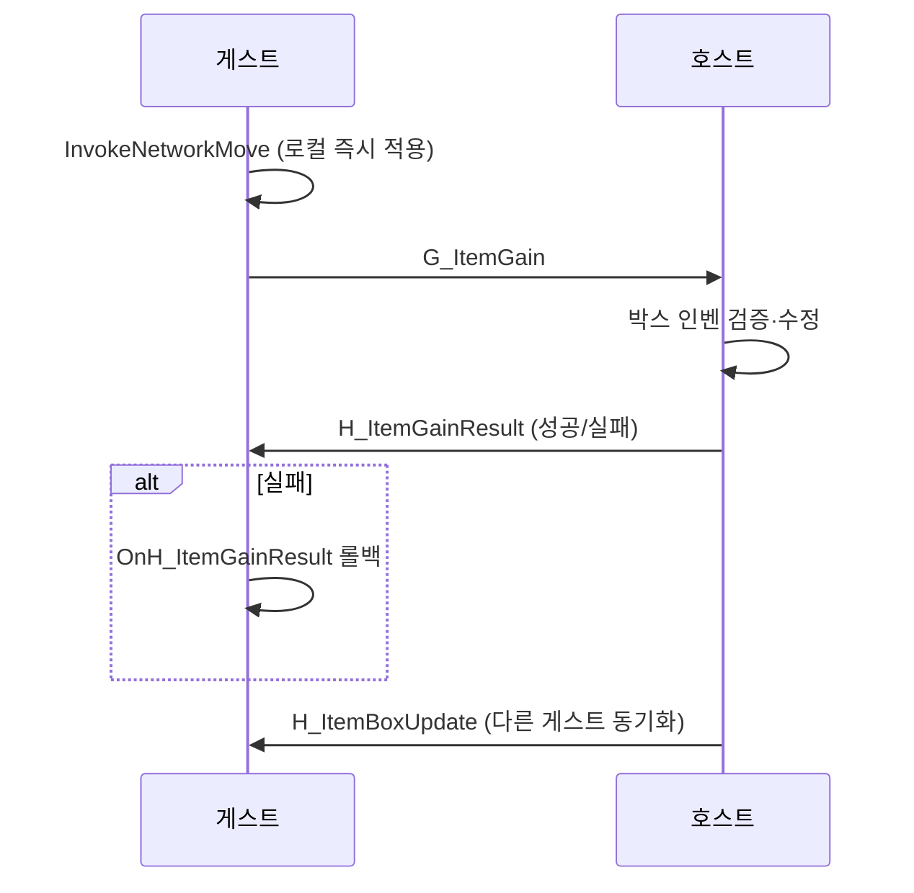

# 인벤토리·아이템 교환 규칙

플레이어 인벤토리, 창고, 아이템 박스, 장비 슬롯 간 드래그&드롭 규칙.

관련 코드: `SlotInteractionManager`, `UI/Inventory/MouseHandler/*`, `Inventory.cs`

---

## 인벤토리 기본 (`Inventory`)

| 개념 | 설명 |
|------|------|
| `_currentCapacity` | 현재 사용 슬롯 수 (가방으로 확장) |
| `_maxCapacity` | 절대 최대 슬롯 |
| `ItemSlot` / `BoxItemSlot` | 플레이어 vs 박스 슬롯 타입 |
| `Uid` | 스택 불가 아이템(무기 등) 인스턴스 식별자. 스택 합산 시 기존 uid 유지 |
| `CanAddItem` | **아이템 ID** 기준 스택 가능 여부 판단 |
| `ChangeInventory` | UI 갱신 이벤트 |

---

## 드래그&드롭 진입점

```
드롭 → BaseDropHandler.OnDrop
         → HandleDrop (성공/실패)
         → SlotInteractionManager.Invoke*
```

실패 시 슬롯 UI 흔들림(`DOShakeAnchorPos`).

### DropHandler 종류

| Handler | 대상 | 네트워크 |
|---------|------|----------|
| `InventoryDropHandler` | 인벤/박스 그리드 슬롯 | 케이스별 (아래 표) |
| `EquipDropHandler` | 무기·방어구·가방 장착 슬롯 | `RoomSync.Equip` (장착 시) |
| `QuickSlotDropHandler` | 퀵슬롯 1~9 | 로컬만 |
| `RepairSlotDropHandler` | 수리대 슬롯 | 로컬만 |
| `GunEnhancementDropHandler` | 무기 강화 슬롯 | 로컬만 |

`ItemHolderDropHandler` 공통:
- `_itemType` 일치해야 드롭 허용
- 우클릭 → `Unequip()` (인벤 공간 있을 때만 반납)
- 장착 슬롯 덮어쓰기 시 기존 아이템은 드래그 원본 슬롯으로 스왑

---

## 슬롯 간 교환 분기 (`InventoryDropHandler`)

### 타겟에 아이템이 있을 때 (스왑)

| From | To | 메서드 | 네트워크 |
|------|-----|--------|----------|
| 플레이어 | 플레이어 | `InvokeLocalSwap` | 없음 |
| 박스 | 박스 | `InvokeBoxSwap` | `H_ItemBoxUpdate` ×2 |
| 박스 | 플레이어 | `InvokeNetworkExchange` | 게스트: `G_ItemExchange` / 호스트: `ItemBoxUpdate` |
| 플레이어 | 박스 | `InvokeNetworkExchange` | 동일 |

### 타겟이 비어 있을 때 (이동)

| From | To | 메서드 | 네트워크 |
|------|-----|--------|----------|
| 플레이어 | 플레이어 | `InvokeLocalMove` | 없음 |
| 박스 | 박스 | `InvokeBoxMove` | `H_ItemBoxUpdate` ×2 |
| 플레이어 ↔ 박스 | | `InvokeNetworkMove` | 게스트: `G_ItemGain` / 호스트: `ItemBoxUpdate` |

---

## 창고 vs 아이템 박스

| | 창고 (`Storage`) | 아이템 박스 (`ItemBox`) |
|--|------------------|-------------------------|
| 씬 | `SC_Shelter` | 레이드 맵 |
| UI | `StorageUI` — Reveal 없음 | `ItemBoxRevealUI` — 공개 연출 |
| 상호 인벤 | `InteractionInventory` 양방향 바인딩 | 동일 |
| 세이브 | `SaveManager` 키 `"storage"` (열기/닫기 시) | 호스트 권위 월드 상태 |
| 드래그 규칙 | **플레이어 ↔ 플레이어** (`InvokeLocal*`) | 플레이어 ↔ 박스 시 **네트워크** |

창고는 멀티플레이에서도 로컬 세이브 기반이므로 **호스트/게스트 각자 창고**를 가진다.

---

## 멀티플레이 — 아이템 박스

### 호스트 권위

- 박스 인벤토리의 진실(source of truth)은 **호스트**
- 게스트가 박스와 교환 시 **낙관적 업데이트** 후 호스트에 요청

### 게스트 흐름 (빈 슬롯 이동)



### 게스트 흐름 (스왑)

1. `InvokeNetworkExchange` — 로컬 `ApplyExchangeLocally` 즉시 적용
2. `G_ItemExchange` → 호스트가 박스 측 검증 후 `ItemBoxUpdate` 브로드캐스트

### 호스트 흐름

네트워크 요청 없이 로컬 적용 후 `RoomSync.ItemBoxUpdate`로 게스트에만 브로드캐스트.

### 롤백 (`OnH_ItemGainResult`)

`Success == false`일 때만 실행. 이미 로컬에 적용된 변경을 되돌림.

| Amount 부호 | 의미 | 롤백 |
|-------------|------|------|
| `> 0` | 플레이어가 가져감 | 플레이어에서 제거 → 박스 반환 |
| `< 0` | 플레이어가 넣음 | 박스에서 제거 → 플레이어 반환 |

### 싱글플레이

`RoomManager.IsHost && !HasGuests` → `RoomSync.IsSolo` — 아이템 패킷 미전송.

---

## 장비 슬롯 (`EquipDropHandler`)

| 슬롯 | `EquipableController` | ItemType |
|------|----------------------|----------|
| 0~1 | `WeaponController` | Weapon |
| 2~3 | `PlayerArmorController` | Helmet / Armor |
| 4 | `BagController` | Bag |

- 장착: `controller.Equip(data, slotIndex, uid)`
- 해제: `CanUnequip` 실패 시 중단 (가방 해제 시 인벤 공간 부족 등)
- 사망 등 외부 해제: `OnSlotUnequipped` → UI만 정리 (인벤 반납 없음)

멀티 장착 동기화: `RoomSync.Equip` → `G/H_Equip`

---

## 퀵슬롯 (`QuickSlotDropHandler`)

- `QuickSlotInventory.TakeFrom` — 인벤 슬롯에서 퀵슬롯으로 이동 (로컬)
- `ConsumeItem` — 사용 시 수량 감소
- `Unequip` — `ReturnTo`로 인벤 반납
- **네트워크 없음**

---

## Ctrl·더블클릭

| 입력 | 동작 |
|------|------|
| Ctrl + 클릭 | `PendingSlot` / `PendingAmount` 누적 (분할 드래그) |
| 더블클릭 | `HoveredSlot.InventoryUI.OnSlotDoubleClicked()` |

---

## 주의사항 (버그 예방)

1. **플레이어 ↔ 박스**에 `InvokeLocalSwap` 사용 금지 — 반드시 `InvokeNetwork*`
2. `G_ItemGain` 호스트 핸들러는 `RoomManager.TryGetGuestIdFromPacket`으로 요청 게스트를 식별 (`CurrentUdpSenderId` / `CurrentSenderEndPoint` 사용)
3. `itemUid == 0`인 아이템은 내구도 동기화 대상 아님 (`RoomSync.Durability`)
4. 창고 드래그는 `IsBox == false` 양쪽이므로 항상 로컬 — 세이브 타이밍(`OnInteractExit`) 확인

관련: [multiplayer.md](../development/network-packets.md) · [save.md](save.md)
