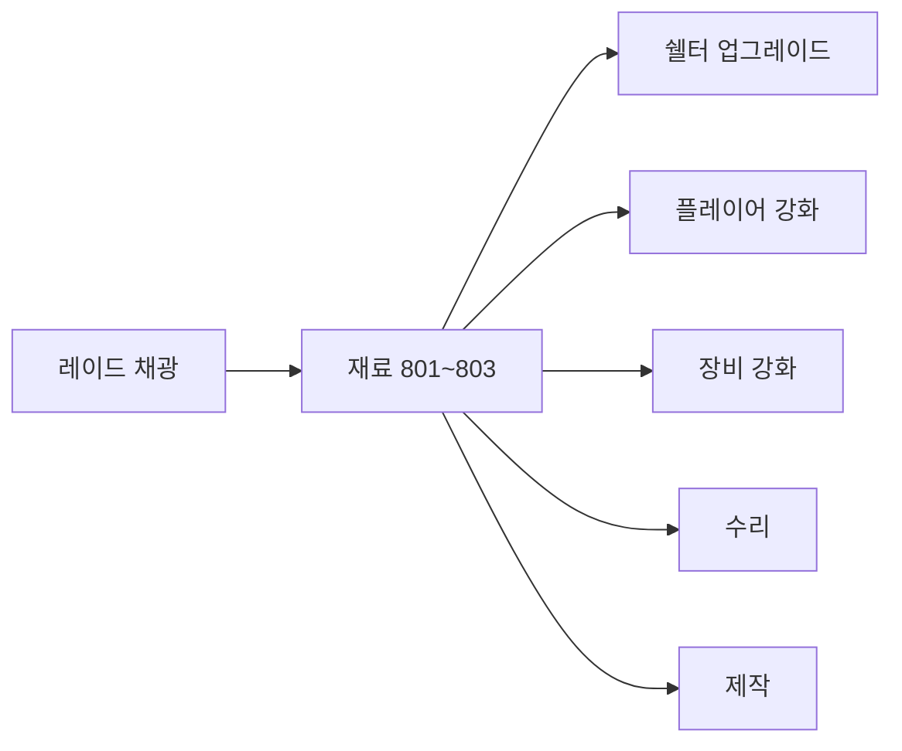

# 성장 & 진행

쉘터 업그레이드 레벨, 플레이어 스탯 강화, 장비 강화, 수리, 제작. **수리·무기 강화·제작은 모두 구현되어 있다** — 과거 문서에 남아있던 미구현 표기는 최신 상태가 아니었다.

## 쉘터 업그레이드

상세: [shelter-raid.md](shelter-raid.md#쉘터-업그레이드-sheltermanager)

- 쉘터 레벨이 행성 티어 잠금 해제에 사용됨
- 재료는 플레이어 인벤 + 창고에서 합산 차감(플레이어 우선)
- 레벨은 세이브됨

---

## 플레이어 스탯 강화 ✅

쉘터 `EnhancementTable`에서 영구 스탯을 레벨업한다. **최대 Lv.10.**

| 스탯 (`EnhancementStatType`) | 레벨당 효과 |
|------|------|
| MaxHp | +10 |
| MaxBattery | +10 |
| MaxStamina | +10 |
| MoveSpeed | +0.25 |

| 클래스 | 역할 |
|--------|------|
| `PlayerEnhancement` | 레벨·보너스 적용, 재료 소비, `PlayerStat.ApplyEnhancementStats`로 반영 |
| `EnhancementTable` | 월드 상호작용 오브젝트 |
| `EnhancementTableUI` | 스탯 선택, 비용/레벨 표시, 강화 버튼. `PlayerEnhancement`/`PlayerStat` 미존재 시 `SetUnavailable()`로 방어적 폴백 |

데이터: `enhancement_cost.csv` — `stat` + `level` 조합당 1행, 재료 최대 2종.

강화 레벨은 세이브에 **포함된다** — [save.md](save.md).

---

## 무기·방어구 강화 ✅

`GunEnhancementTable`(월드 상호작용) + `GunEnhancementTableUI`. **최대 Lv.3.**

- 드롭 슬롯(`GunEnhancementDropHandler`)이 `ItemType`(Weapon/Armor/Helmet/GunPart)별로 유효성 검사
- `OnClickEnhance()` — 현재 레벨 조회(`WorldEquipmentManager.GetEnhancementLevel`) → 상한 체크 → `ItemEnhancementCostTable` 비용 + 전력(고정 50) 소비 → `WorldEquipmentManager.SetEnhancementLevel(uid, level+1, itemId)`
- uid가 있는 장착 아이템은 uid 기준, uid가 없는(인벤에 있는) 스택 아이템은 itemId 기준(`_itemTypeEnhancementLevels`)으로 레벨을 별도 관리
- 강화 전/후 스탯 미리보기(`BuildStatDescription`)는 `GunPartTable`/`ArmorStatTable` 배율을 UI 쪽에서 별도 계산 — `WorldEquipmentManager`와 동일 공식이 두 곳에 중복 구현되어 있음(기능 문제는 아니나 유지보수 시 동기화 필요)

데이터: `item_enhancement_cost.csv` — `item_id` + `level` 조합당 1행.

---

## 수리 ✅

`RepairWorkbench`(상호작용) + `RepairWorkbenchUI`.

- `OnClickRepair()` — 드롭된 아이템의 `RepairCostTable` 조회 → 재료 보유 확인 → 이미 최대 내구도면 중단 → 전력(고정 30) 소비 → 재료 차감 → `WorldEquipmentManager.ApplyChange`로 내구도 복구 → `RoomSync.Durability`로 동기화
- 슬롯 내구도 표시(`Refresh()`)는 현재/최대값을 실시간으로 보여줌, 재료 비용·전력 비용 텍스트는 충분/부족에 따라 색상 표시

데이터: `repair_cost.csv` — `item_id`(수리 대상 무기/헬멧/갑옷)당 고정 재료.

---

## 제작 (Crafting) ✅

`CraftingTable`(상호작용) + `CraftingTableUI`.

- 카테고리 탭이 결과 아이템의 `ItemType`으로 레시피(`crafting_recipe.csv`, `CraftingRecipeTable`)를 필터링
- `OnClickCraft()` — 재료 최대 3종(`NeedItem1/2/3Id`) 보유 확인 → 인벤 공간 확인(`CanAddItem`) → 전력(고정 20) 소비 → 재료 차감 → 결과 아이템 지급
- `CraftingTableUI.HasRecipesOfType()`은 정의돼 있으나 어디서도 호출되지 않는 죽은 코드

데이터: `crafting_recipe.csv` — id는 결과 아이템의 Item ID와 1:1.

---

## 워크벤치 전력 비용 요약

| 워크벤치 | 전력 비용 (고정) |
|----------|------------------|
| 수리대 | 30 |
| 무기/방어구 강화대 | 50 |
| 제작대 | 20 |

전력원: `Generator.Instance.TryConsume(cost)` — 부족하면 UI에 실패 안내.

---

## 재료 아이템 흐름

| 아이템 ID | 이름 (대략) | 획득 |
|-----------|-------------|------|
| 801 | 돌 | Mineral 1 채광 |
| 802 | 철 | Mineral 2 채광 |
| 803 | 금 | Mineral 3 채광 |

ItemType: `Ingredient` (800~899 범위)
