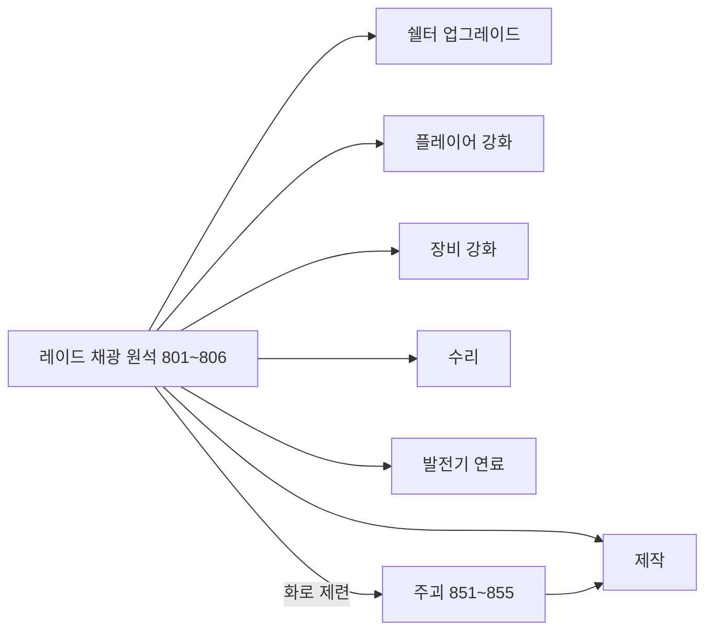

# 성장 & 진행

쉘터 업그레이드 레벨, 플레이어 스탯 강화, 장비 강화, 수리, 제작. **수리·무기 강화·제작은 모두 구현되어 있다** — 과거 문서에 남아있던 미구현 표기는 최신 상태가 아니었다.

## 쉘터 업그레이드

상세: [shelter-raid.md](shelter-raid.md#쉘터-업그레이드-sheltermanager)

- 쉘터 레벨이 행성 티어 잠금 해제에 사용됨
- 재료는 플레이어 인벤 + 창고에서 합산 차감(플레이어 우선)
- 레벨은 세이브됨

---

## 플레이어(기체) 강화 — 레벨 + 스탯 포인트 ✅

쉘터 `EnhancementTable`에서 재료를 소모해 **기체(캐릭터) 레벨**을 올리고, 레벨업마다 **스탯 포인트**를 받아 6개 스탯을 개별 강화하는 2단계 구조. 인스펙터에서 상한을 조절하는 기체 레벨(기본 20)과 달리 개별 스탯 레벨 자체는 상한이 없다 — 포인트만 있으면 계속 올릴 수 있다.

| 스탯 (`EnhancementStatType`) | 성장 방식 | 기본 레벨당 효과 |
|------|------|------|
| AttackPower | 배율형 | +5% (장착 무기 데미지) |
| MoveSpeed | 가산형 | +0.25 |
| MaxHp | 가산형 | +10 |
| DefenseRate | 가산형 | +2%p |
| VisionRange | 가산형 | +1 (탐지 반경) |
| AttackSpeed | 배율형 | +5% (장착 무기 RPM) |

배터리/스태미나는 이 강화 대상에서 제외되고 `PlayerStat`에 고정값으로만 남는다.

스탯 목록은 `PlayerEnhancement._growthConfigs`(인스펙터 리스트)에 항목을 추가/삭제하는 것만으로 늘리거나 줄일 수 있다 — 레벨은 `Dictionary<EnhancementStatType,int>`로 관리해 목록 변경에 코드 수정이 필요 없다.

| 클래스 | 역할 |
|--------|------|
| `PlayerEnhancement` | 기체 레벨업(재료 소비 → 포인트 지급), 포인트 소비(스탯 레벨업), `GetBonus`로 보너스 계산 후 `PlayerStat`/`PlayerVision`/장착 `GunBase`에 반영 |
| `EnhancementTable` | 월드 상호작용 오브젝트 |
| `EnhancementTableUI` | 상단 탭(레벨/스탯) 전환만 담당하는 컨테이너. 선택된 탭에 따라 `_levelPanel`/`_statPanel` GameObject를 켜고 끄며, `EnhancementLevelUpUI`/`EnhancementStatUI`에 `PlayerEnhancement`를 전달 |
| `EnhancementLevelUpUI` | 레벨 탭 패널 — 기체 레벨/비용/레벨업 버튼만 다룸 |
| `EnhancementStatUI` | 스탯 탭 패널 — 6개 스탯 선택 + 상세/포인트 소비 버튼. `PlayerEnhancement` 미존재 시 `SetUnavailable()`로 방어적 폴백 |
| `GunBase` | `Owner` 설정 시 `PlayerEnhancement`를 캐시해 `_stat.damage`/`_stat.rpm`에 공격력/공격속도 배율을 곱함(`ApplyOwnerCombatMultipliers`) — 파츠 재계산(`RecalculateStat`) 때마다 재적용되므로 중복 적용 없음 |

데이터: `character_level_cost.csv` — `level`당 1행(재료 최대 2종 + `stat_points`). 기존 `enhancement_cost.csv`(스탯별 개별 강화 비용)는 이 구조로 대체되어 제거됨.

강화 레벨은 세이브에 **포함된다**(`SaveManager.SaveCharacterEnhancement`/`TryLoadCharacterEnhancement`) — [save.md](save.md). *(과거 이 문서는 "세이브에 포함된다"고 되어 있었으나 실제 `SaveManager`에는 대응 코드가 없었다 — 이번 개편에서 실제로 추가됨.)*

**알려진 한계:** 협동모드에서 게스트의 공격력/공격속도 포인트는 호스트의 데미지 판정에 반영되지 않는다. 호스트는 게스트가 쏜 총알을 게스트가 보낸 패킷이 아니라 호스트 쪽 미러 `GunBase`(`GuestValidator.TryGetGuestWeapon`)의 `_stat`으로 직접 판정하는데, 이 미러 오브젝트의 `PlayerEnhancement` 상태를 게스트와 동기화하는 경로가 아직 없다. HP/이동속도/방어력은 기존 `RoomSync.StatSync`가 최종 값을 실어 나르므로 문제없고, 시야는 로컬 전용이라 무관하다.

---

## 무기·방어구 강화 ✅

`GunEnhancementTable`(월드 상호작용) + `GunEnhancementTableUI`. **최대 Lv.3.**

- 드롭 슬롯(`GunEnhancementDropHandler`)이 `ItemType`(Weapon/Armor/Helmet/GunPart)별로 유효성 검사
- `OnClickEnhance()` — 현재 레벨 조회(`WorldEquipmentManager.GetEnhancementLevel`) → 상한 체크 → `ItemEnhancementCostTable` 비용 + 전력(고정 50) 소비 → `WorldEquipmentManager.SetEnhancementLevel(uid, level+1, itemId)`
- uid가 있는 장착 아이템은 uid 기준, uid가 없는(인벤에 있는) 스택 아이템은 itemId 기준(`_itemTypeEnhancementLevels`)으로 레벨을 별도 관리
- 강화 전/후 스탯 미리보기(`BuildStatDescription`)는 `GunPartTable`/`ArmorStatTable` 배율을 UI 쪽에서 별도 계산 — `WorldEquipmentManager`와 동일 공식이 두 곳에 중복 구현되어 있음(기능 문제는 아니나 유지보수 시 동기화 필요)

데이터: `item_enhancement_cost.csv` — `item_id` + `level` 조합당 1행.

---

## 수리 ✅

`RepairWorkbench`(상호작용) + `RepairWorkbenchUI`.

- `OnClickRepair()` — 드롭된 아이템의 `RepairCostTable` 조회 → 재료 보유 확인 → 이미 최대 내구도면 중단 → 전력(고정 30) 소비 → 재료 차감 → `WorldEquipmentManager.ApplyChange`로 내구도 복구 → `RoomSync.Durability`로 동기화
- 슬롯 내구도 표시(`Refresh()`)는 현재/최대값을 실시간으로 보여줌, 재료 비용·전력 비용 텍스트는 충분/부족에 따라 색상 표시

데이터: `repair_cost.csv` — `item_id`(수리 대상 무기/헬멧/갑옷)당 고정 재료.

---

## 제작 (Crafting) ✅

`CraftingTable`(상호작용) + `CraftingTableUI`.

- 카테고리 탭이 결과 아이템의 `ItemType`으로 레시피(`crafting_recipe.csv`, `CraftingRecipeTable`)를 필터링
- `OnClickCraft()` — 재료 최대 3종(`NeedItem1/2/3Id`) 보유 확인 → 인벤 공간 확인(`CanAddItem`) → 전력(고정 20) 소비 → 재료 차감 → 결과 아이템 지급
- `CraftingTableUI.HasRecipesOfType()`은 정의돼 있으나 어디서도 호출되지 않는 죽은 코드

데이터: `crafting_recipe.csv` — id는 결과 아이템의 Item ID와 1:1.

---

## 화로 제련 ✅

`Furnace`(싱글턴) + `FurnaceUI`. 다른 워크벤치와 달리 **상호작용 오브젝트가 아니라 항상 진행되는 시설**이며, UI를 닫아도 제련은 계속된다.

- 투입/결과 슬롯 각 1개. `FurnaceRecipeTable.Get(투입 아이템 id)`로 결과 아이템(`result_item_id`)·시간(`smelt_seconds`) 조회 — 레시피가 없는 광석(돌 801)은 투입 불가
- 서로 다른 광석은 섞이지 않음(투입 중인 것과 다른 아이템이면 거부, 먼저 회수해야 함), 결과 칸이 꽉 차면 제련을 멈추고 대기
- 호스트 권위 + 게스트 네트 동기화(`G/H_FurnaceInsert`·`G_FurnaceTake`·`H_FurnaceState`·`H_FurnaceGive`) — [network-packets.md](../development/network-packets.md#쉘터-화로-furnace)
- **전력을 소비하지 않는다** — `Generator`를 전혀 참조하지 않아 다른 워크벤치(아래 표)와 동작이 다름. 의도된 설계인지 미완성인지 확인 필요

데이터: `furnace_recipe.csv` — id = **투입** 광석의 Item ID(1:1, 결과가 아니라 투입 기준이라 `CraftingRecipe`와 방향이 반대) — [datatable/id-ranges.md](../datatable/id-ranges.md).

---

## 워크벤치 전력 비용 요약

| 워크벤치 | 전력 비용 (고정) |
|----------|------------------|
| 수리대 | 30 |
| 무기/방어구 강화대 | 50 |
| 제작대 | 20 |
| 화로 | 없음 (전력 미소비) |

전력원: `Generator.Instance.TryConsume(cost)` — 부족하면 UI에 실패 안내.

---

## 재료 아이템 흐름

| 아이템 ID | 이름 (대략) | 획득 |
|-----------|-------------|------|
| 801 | 돌 | Mineral 1 채광 (화로 레시피 없음) |
| 802 | 철광석 | Mineral 2 채광 → 화로로 851(철 주괴) 제련 |
| 803 | 금광석 | Mineral 3 채광 → 화로로 852(금 주괴) 제련 |
| 804~806 | 석탄/우라늄/레드 플라즈마 원석 | `item.csv`·`generator_fuel.csv`·`furnace_recipe.csv`엔 정의돼 있으나 `mineral.csv`엔 대응 채광 오브젝트가 없음 — **레이드에서 획득할 방법이 아직 없는 죽은 데이터**(치트로만 획득 가능) |

ItemType: `Ingredient` (800~899 범위) — 801~806 원석, 851~855 화로 제련 결과물(주괴)
