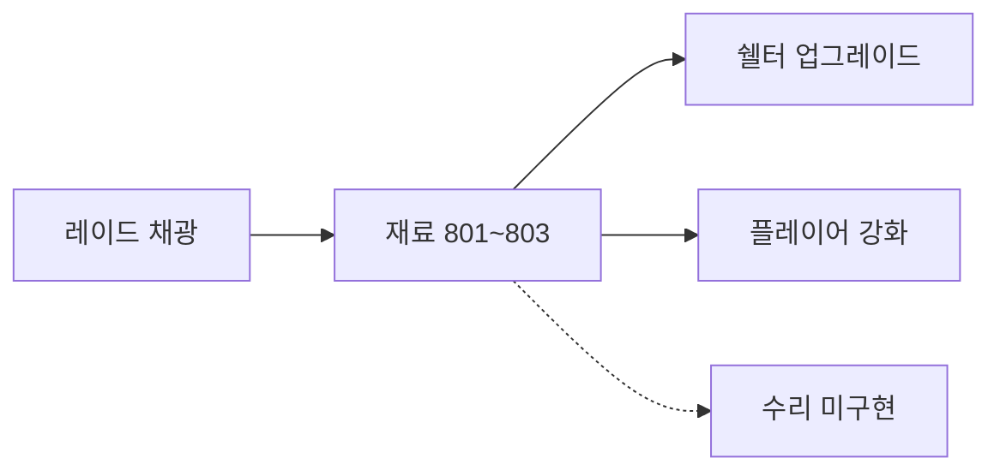

# 성장 & 진행

> 미구현 항목(수리, 무기 강화, 제작): [todo.md](todo.md)

## 쉘터 업그레이드

상세: [shelter-raid.md](shelter-raid.md#쉘터-업그레이드-sheltermanager)

- 쉘터 레벨이 행성 티어 잠금 해제에 사용됨
- 재료는 플레이어 인벤 + 창고에서 합산 차감
- 레벨은 세이브됨

---

## 플레이어 스탯 강화 ✅

### 개요

쉘터 `EnhancementTable`에서 영구 스탯을 레벨업한다. 최대 Lv.10.

### 대상 스탯 (`EnhancementStatType`)

| 스탯 | 효과 |
|------|------|
| MaxHp | 최대 HP 증가 |
| MaxBattery | 최대 배터리 증가 |
| MaxStamina | 최대 스태미나 증가 |
| MoveSpeed | 이동 속도 증가 |

### 구현

| 클래스 | 역할 |
|--------|------|
| `PlayerEnhancement` | 레벨·보너스 적용, 재료 소비 |
| `EnhancementTable` | 월드 상호작용 오브젝트 |
| `EnhancementTableUI` | 스탯 선택, 비용/레벨 표시, 강화 버튼 |

### 데이터 (`enhancement_cost.csv`)

`stat` + `level` 조합당 1행 — `need_item1/2` 재료 정의.

### 미저장

강화 레벨은 **세이브에 포함되지 않음** — [save.md](save.md) 참고.

---

## 무기 강화 ⚠️

| 구현됨 | 미구현 |
|--------|--------|
| `GunEnhancementTable` 상호작용 | 강화 로직 |
| `GunEnhancementDropHandler` 드롭 슬롯 | 전용 UI 스크립트 |
| UI 패널 등록 (`UIType.GunEnhancementTable`) | 비용 테이블 연동 |

---

## 수리 ⚠️

| 구현됨 | 미구현 |
|--------|--------|
| `RepairWorkbench` 상호작용 | `OnClickRepair()` 수리 로직 |
| `RepairWorkbenchUI` 재료 텍스트 표시 | 슬롯 내구도 표시 (`? / ?`) |
| `RepairCostTable` 비용 조회 | 실제 내구도 복구 |

데이터: `repair_cost.csv` — `item_id`(수리 대상 무기/헬멧/갑옷)당 고정 재료.

---

## 제작 (Crafting) ❌

구현 없음. `craft` 관련 코드·테이블 없음.

---

## 재료 아이템 흐름

| 아이템 ID | 이름 (대략) | 획득 |
|-----------|-------------|------|
| 801 | 돌 | Mineral 1 채광 |
| 802 | 철 | Mineral 2 채광 |
| 803 | 금 | Mineral 3 채광 |

ItemType: `Ingredient` (800~899 범위)
