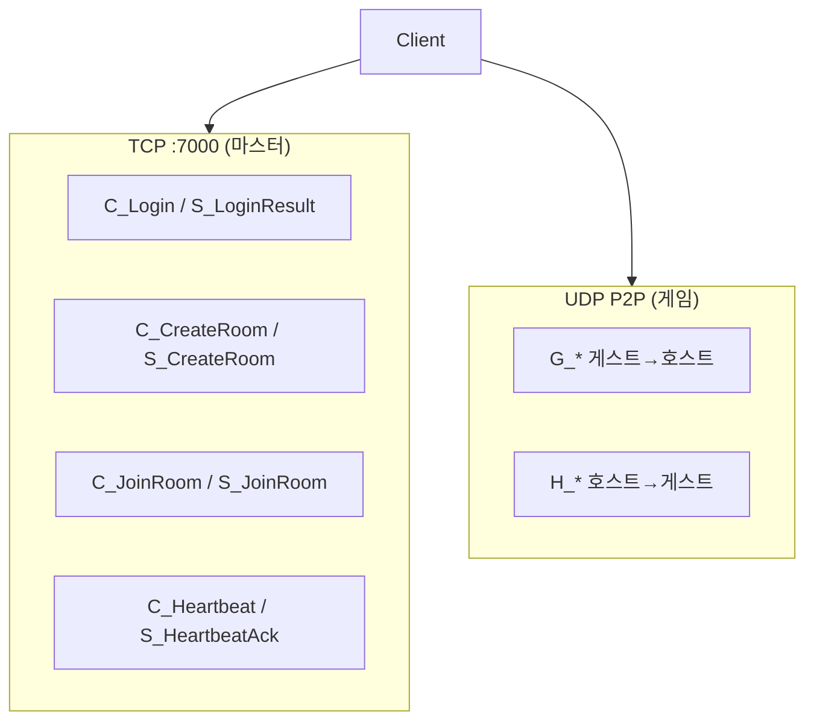

# 네트워크 패킷

TCP 마스터 서버 + UDP P2P 게임 세션의 패킷 구조와 흐름.

스키마: `PocoPoachers/FlatBuffer/Schemas/`  
생성 코드: `Assets/01. Scripts/Generated/FlatBuffer/`

---

## 2계층 구조



| 계층 | 전송 | 담당 |
|------|------|------|
| TCP | `NetworkManager` → `Session` | 로그인, 방 생성/참가, NetInfo 교환 |
| UDP | `RoomManager` → `UdpSession` | 이동, 전투, 아이템, 적 동기화 |

게임 로직(적 AI, 박스 상태, 내구도)은 **호스트 권위**. 마스터 서버는 중계만.

---

## 패킷 네이밍

| 접두사 | 방향 | 예 |
|--------|------|-----|
| `C_` | Client → Master (TCP) | `C_Login`, `C_CreateRoom` |
| `S_` | Master → Client (TCP) | `S_LoginResult`, `S_GuestJoined` |
| `G_` | Guest → Host (UDP) | `G_Move`, `G_ItemGain` |
| `H_` | Host → Guest(s) (UDP) | `H_Move`, `H_ItemBoxUpdate` |

`Main.fbs`의 `union PacketType`에 전체 목록 정의.

---

## 패킷 바이너리 형식

```
[2바이트 uint16 totalSize][FlatBuffer FlatPacket payload]
```

- `Session.HeaderSize` = 2
- `FlatPacket` = `{ type: PacketType, union payload }`
- 빌드: `PacketBuilder.Build` / `BuildSegment`

---

## 송신 API (`PacketBuilder`)

| 메서드 | 경로 |
|--------|------|
| `SendToMaster` | `NetworkManager.Session` (TCP) |
| `SendToHost` | `RoomManager.UdpSendToHost` |
| `SendToGuest` | `RoomManager.UdpSendToGuest` |
| `BroadcastToGuests` | 모든 게스트 UDP |

게임 패킷 송신 진입점: `RoomSync` (이동·사격·장착·아이템·스탯·적)

---

## 수신 흐름

### TCP

```
Connector → Session.OnReceived → PacketManager.HandlePacket
```

`NetworkManager`가 `Session` 생성 시 `PacketManager.HandlePacket` 등록.

### UDP

```
UdpSession (백그라운드 스레드)
  → RoomManager.OnUdpReceived
  → MainThreadDispatcher.Enqueue
  → PacketManager.HandlePacket
```

UDP 수신은 **반드시 메인 스레드**에서 핸들러 실행.  
`OnUdpReceived`에서 `_lastGuestId` / `_lastGuestEp`를 잠시 설정해 `G_*` 핸들러가 요청 게스트를 식별.

### 디스패치 (`PacketManager`)

1. 2바이트 헤더 제거
2. `FlatPacket.GetRootAsFlatPacket` 파싱
3. `PacketType` → `PacketManager.Generated.cs`에 등록된 `PacketHandlers.On*` 호출

핸들러 위치:
- `SPacketHandlers/` — `S_*` (마스터 응답)
- `GPacketHandlers/` — `G_*` (게스트가 보낸 것, **호스트만 처리**)
- `HPacketHandlers/` — `H_*` (호스트가 보낸 것, **게스트가 수신**)

---

## 연결 수립

### 호스트

1. `RoomManager.StartAsHost()` → STUN으로 공인 IP/포트 획득
2. TCP `C_CreateRoom` + `NetInfo`
3. `S_CreateRoom` — 세션 코드(6자리) 수신
4. 게스트 참가 시 `S_GuestJoined` → UDP 홀펀칭 (`UdpHolePuncher`)
5. `H_GuestJoined` 브로드캐스트

### 게스트

1. `RoomManager.StartAsGuest(code)`
2. TCP `C_JoinRoom`
3. 호스트 NetInfo 수신 → UDP 펀칭 → `OnGameStarted`

### 로컬 폴백

`RoomManager.StartLocalHost()` — TCP/UDP 없이 즉시 호스트.  
`RoomSync.IsSolo` 시 게임 패킷 미전송.

---

## 패킷 목록 (게임)

### 플레이어

| 패킷 | 방향 | 용도 |
|------|------|------|
| `G/H_Move` | 양방향 | 위치·회전·이동 상태 |
| `G/H_Shoot` | 양방향 | 발사 (원점·방향·스탯) |
| `G/H_Equip` | 양방향 | 장비 변경 |
| `G/H_Durability` | G→H 요청, H→G 결과 | 무기 내구도 |
| `G/H_StatSync` | 양방향 | HP 등 스탯 |
| `G/H_Leave` | — | 퇴장 |

### 아이템

| 패킷 | 방향 | 용도 |
|------|------|------|
| `H_ItemSpawn` | H→G | 박스 스폰 |
| `H_ItemDespawn` | H→G | 월드 아이템 제거 |
| `G_ItemGain` | G→H | 빈 슬롯 이동 요청 |
| `H_ItemGainResult` | H→G | 성공/실패 (실패 시 롤백) |
| `G_ItemExchange` | G→H | 스왑 요청 |
| `H_ItemBoxUpdate` | H→G | 박스 슬롯 델타 |

상세 교환 규칙: [inventory-exchange.md](../design/inventory-exchange.md)

### 적

`H_EnemySpawn`, `H_EnemyMove`, `H_EnemyHit`, `H_EnemyDie`

---

## 새 패킷 추가 절차

1. `FlatBuffer/Schemas/Game/*.fbs`에 `table G_MyPacket { ... }` 추가
2. `Main.fbs` → `union PacketType`에 `G_MyPacket`, `H_MyPacket` 등록
3. Unity 메뉴 **Tools → Generator → Packets** 실행
4. 생성물 확인:
   - `Generated/FlatBuffer/*.cs` (클라+서버)
   - `PacketManager.Generated.cs` (등록)
   - `PacketHandler.*.temp.cs` (스텁 — **기존 핸들러 없을 때만**)
5. `GPacketHandlers/` 또는 `HPacketHandlers/`에 `OnG_MyPacket` 구현
6. `RoomSync`에 송신 헬퍼 추가 (필요 시)
7. 서버 `C_*` 패킷이면 `Server/Server/Net/Packet/PacketHandler/` 구현

> 기존 핸들러 파일이 있으면 스텁이 `.temp.cs`로 생성됨 — 수동 병합 후 삭제.

---

## 환경 설정

`NetworkManager` (인스펙터):

| 필드 | 기본 | 설명 |
|------|------|------|
| `localHost` | 127.0.0.1 | 로컬 마스터 |
| `remoteHost` | (배포 IP) | 원격 마스터 |
| `port` | 7000 | TCP 포트 |
| `remoteConnection` | false | true 시 remoteHost 사용 |

`RoomManager`: STUN `stun.l.google.com:19302`, 게스트 타임아웃 30초.

---

## 디버깅 팁

- `PacketManager`가 `H_Move`/`G_Move` 외 수신 시 로그 출력
- UDP 핸들러에서 `UnityEngine.Object` 접근 전 `MainThreadDispatcher` 사용
- `G_*` 핸들러: `if (!RoomManager.IsHost) return;` 패턴 확인
- 싱글 테스트: `StartLocalHost()` 후 패킷 없이 동작하는지 확인

관련: [multiplayer.md](../design/multiplayer.md) · [code-generators.md](code-generators.md)
