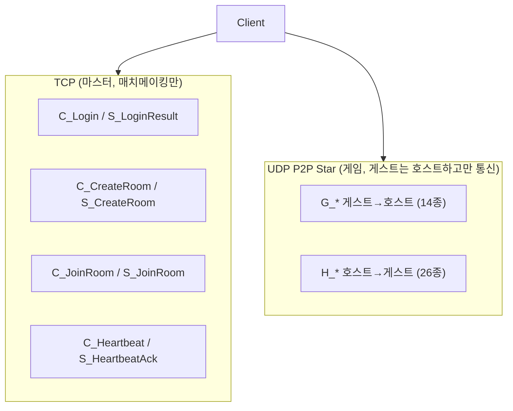

# 네트워크 패킷

TCP 마스터 서버 + UDP P2P 게임 세션의 패킷 구조와 흐름. 아키텍처·권위 모델 개요는 [multiplayer.md](../design/multiplayer.md).

스키마: `PocoPoachers/FlatBuffer/Schemas/`
생성 코드: `Assets/01. Scripts/Generated/FlatBuffer/` (+ 서버 측 `Server/Server/Generated/FlatBuffer/`)

---

## 2계층 구조



| 계층 | 전송 | 담당 |
|------|------|------|
| TCP | `NetworkManager` → `Session` (2바이트 길이 헤더, `SocketAsyncEventArgs`) | 로그인, 방 생성/참가, NetInfo 교환 — 게임플레이 트래픽 없음 |
| UDP | `RoomManager` → `UdpSession` | 이동, 전투, 아이템, 적 동기화 |

---

## 패킷 네이밍

| 접두사 | 방향 | 개수(대략) | 예 |
|--------|------|------------|-----|
| `C_` | Client → Master (TCP) | 5 | `C_Login`, `C_CreateRoom` |
| `S_` | Master → Client (TCP) | 5 | `S_LoginResult`, `S_GuestJoined` |
| `G_` | Guest → Host (UDP) | 14 | `G_Move`, `G_ItemGain` |
| `H_` | Host → Guest(s) (UDP) | 26 | `H_Move`, `H_ItemBoxUpdate` |

`Main.fbs`의 `union PacketType` 안에 `FlatPacket{ type }`으로 전체 목록 정의(약 50종). 핸들러는 패킷 1개당 파일 1개가 아니라 **도메인별 partial class**로 묶여 있다: `GPacketHandlers/`·`HPacketHandlers/` 각 10개 파일(Combat/Durability/Equip/GunAmmo/GunPart/GunState/Item/Movement/Rescue/Room/Stat/Enemy 등), `SPacketHandlers/` 3개 파일(Auth/Heartbeat/Room).

---

## 패킷 바이너리 형식

```
[2바이트 uint16 totalSize][FlatBuffer FlatPacket payload]
```

- `Session.HeaderSize = 2`
- 빌드: `PacketBuilder.Build` / `BuildSegment`

---

## 송신 API (`PacketBuilder`)

| 메서드 | 경로 |
|--------|------|
| `SendToMaster` | `NetworkManager.Session` (TCP) |
| `SendToHost` | `RoomManager.UdpSendToHost` |
| `SendToGuest` | `RoomManager.UdpSendToGuest` |
| `SendReliableToGuest` | `RoomManager.UdpSendReliableToGuest` (재전송·ACK) |
| `BroadcastToGuests` | 모든 게스트 UDP (`skipPlayerId`로 특정 게스트 제외 가능) |

게임 패킷 송신 진입점: `RoomSync` (이동·사격·장착·아이템·스탯·적).

---

## 수신 흐름

### TCP

```
Connector → Session.OnReceived → PacketManager.HandlePacket
```

### UDP

```
UdpSession (백그라운드 스레드)
  → RoomManager.OnUdpReceived / HandleReliablePacket
  → MainThreadDispatcher.Enqueue
  → PacketManager.HandlePacket
```

UDP 수신 핸들러는 **반드시 메인 스레드**에서 실행돼야 한다(Unity API 접근 때문). `OnUdpReceived`/`HandleReliablePacket`이 `CurrentUdpSenderId`/`CurrentSenderEndPoint`를 잠시 설정하고, `G_*` 호스트 핸들러는 `TryGetGuestIdFromPacket`으로 게스트 ID를 확인한다.

신뢰 전송(`UdpReliable`)은 `H_ItemGainResult`, `H_ItemExchangeResult`, `H_ShootRejected`, `H_LoadScene`, `G_SceneReady` 등 유실되면 상태가 어긋나는 중요 패킷에 사용.

### 디스패치 (`PacketManager`)

1. 2바이트 헤더 제거
2. `FlatPacket.GetRootAsFlatPacket` 파싱
3. `PacketType` → `PacketManager.Generated.cs`에 등록된 `PacketHandlers.On*` 호출

---

## 연결 수립

### 호스트

1. `RoomManager.StartAsHost()` → STUN으로 공인 IP/포트 획득
2. TCP `C_CreateRoom` + `NetInfo`
3. `S_CreateRoom` — 세션 코드(6자리) 수신
4. 게스트 참가 시 `S_GuestJoined` → `StartUdpPunch`(`UdpHolePuncher`)
5. `H_GuestJoined` 브로드캐스트

### 게스트

1. `RoomManager.StartAsGuest(code)`
2. TCP `C_JoinRoom` (방에 이미 2명이면 서버가 거부)
3. 호스트 NetInfo 수신 → `StartUdpPunch` → `OnGameStarted`

### 로컬 폴백

`RoomManager.StartLocalHost()` — TCP/UDP 없이 즉시 호스트(코드 주석: 임시 폴백).
`RoomSync.IsSolo` 시 게임 패킷 미전송.

---

## 패킷 목록 (게임)

### 플레이어

| 패킷 | 방향 | 용도 |
|------|------|------|
| `G/H_Move` | 양방향 | 위치·회전·이동 상태 — 호스트는 검증 없이 그대로 중계(클라이언트 사실상 권위) |
| `G/H_Shoot` | 양방향 | 발사 (원점·방향·스탯). `G_Shoot`엔 `sound_range`가 있으나 `H_Shoot`엔 없어 다른 게스트에게 소리 범위가 전파 안 됨 |
| `H_ShootRejected` | H→G (신뢰) | 발사 거부 시 탄약·내구도 롤백 |
| `G/H_Equip` | 양방향 | 장비 변경 |
| `G/H_Durability` | G→H 요청, H→G 결과 | 무기 내구도 |
| `G/H_StatSync` | 양방향 | HP 등 스탯 (호스트가 `GuestValidator`로 클램프) |
| `G/H_Leave` | — | 퇴장 |
| `G_SceneReady` | G→H (신뢰) | 씬 로드 완료 알림 — 호스트가 박스/적 스냅샷 전송 트리거 |
| `H_MoveRequest` | H→G (신뢰) | 팀 이동 제안 — 게스트가 수락/거절 팝업을 띄운다 |
| `G_MoveReply` | G→H (신뢰) | 이동 제안 응답 (수락/거절) |
| `H_MoveProgress` | H→G (신뢰) | 투표 현황 (표시 순서 + 인덱스별 수락 여부) — 게스트도 같은 인원 아이콘 열을 그린다 |
| `H_MoveCancel` | H→G (신뢰) | 이동 무산 통보 (0=거절 1=시간 초과 2=호스트 취소) |
| `H_EscapeState` | H→G (신뢰) | 탈출 구역 충전 시작/리셋/완료 — 게이지·결과창 동기화 |
| `G_Nickname` | G→H (신뢰) | 접속 직후 자기 닉네임 보고. 호스트는 payload의 id가 아니라 송신자 id로 키를 잡는다 |
| `H_Roster` | H→G (신뢰) | 방 전체 닉네임 명부 — 델타가 아닌 전체 스냅샷이라 몇 번 도착하든 결과가 같다. 클라는 `PlayerNameRegistry`에 보관 |

### 아이템

| 패킷 | 방향 | 용도 |
|------|------|------|
| `H_ItemSpawn` | H→G | 박스 스폰 (`item_slots`로 슬롯 배치 일치, 이미 등록된 uid면 스폰 없이 내용물만 갱신 — 쉘터 창고) |
| `H_ItemDespawn` | H→G | 월드 아이템 제거 |
| `G_ItemGain` | G→H | 빈 슬롯 이동 요청 |
| `H_ItemGainResult` | H→G | 성공/실패 (실패 시 롤백) |
| `G_ItemExchange` | G→H | 스왑 요청 |
| `H_ItemExchangeResult` | H→G (신뢰) | 성공/실패 (실패 시 롤백) |
| `H_ItemBoxUpdate` | H→G | 박스 슬롯 델타 |
| `G_ConsumeItem` / `H_ConsumeItemResult` | 양방향 | 퀵슬롯 소모품 사용 — 일반 아이템 교환과 별도 경로 |

상세 교환 규칙: [inventory-exchange.md](../design/inventory-exchange.md)

### 적 (전부 호스트→게스트 단방향, `G_Enemy*` 없음)

`H_EnemySpawn`, `H_EnemyMove`, `H_EnemyHit`, `H_EnemyDie`, `H_EnemySpeak`, `H_EnemyShoot`

### 쉘터 창고 (Storage)

씬에 미리 배치 + `ObjectManager.RegisterSceneObject`로 고정 UID(`Storage.STORAGE_UID = 1`, 필드 박스는 1000~) 자기등록. `WorldObject`가 붙으면서 `InventoryUI.IsBox`가 true가 되어 기존 박스 교환 패킷이 그대로 동작한다. 내용물은 호스트만 `SaveManager`로 영속화하고(슬롯 변경 이벤트 기반), 게스트는 씬 준비 후 `H_ItemSpawn` 스냅샷으로 받는다.

### 씬 전환 시 월드 오브젝트 동기화

로켓 행성 선택으로 팀 전체가 이동할 때는 호스트가 바로 `H_LoadScene`을 쏘지 않고 **`SceneMoveVote`가 게스트 전원의 수락을 기다린다**(기본 20초). 전원 수락 시에만 기존 `SceneTransition.Go` 경로를 타고, 한 명이라도 거절하거나 시간이 지나면 `H_MoveCancel`로 무산된다. 포털·탈출 이동은 지금도 즉시 전환이다.

인원 아이콘은 호스트·게스트가 같은 목록(`_order`/`_accepted`, 0번이 호스트)으로 그린다. 호스트는 응답·퇴장이 있을 때마다 `H_MoveProgress`를 뿌리고, 게스트는 받은 목록으로 다시 그린다. 팝업보다 현황이 먼저 도착할 수 있어 게스트는 마지막 현황을 들고 있다가 팝업이 열릴 때 반영한다.

호스트는 씬 전환 직후가 아니라 **게스트의 `G_SceneReady` 수신 후**에 박스(`H_ItemSpawn`)와 적(`H_EnemySpawn`) 스냅샷을 신뢰 전송한다. 게스트가 아직 로딩 중일 때 보내면 유실되기 때문. 호스트 자신이 스폰 전이면 `RoomManager._sceneReadyGuests`에 대기시켰다가 스폰 완료 다음 프레임에 일괄 전송한다.

---

## 새 패킷 추가 절차

1. `FlatBuffer/Schemas/Game/*.fbs`에 `table G_MyPacket { ... }` 추가
2. `Main.fbs` → `union PacketType`에 `G_MyPacket`, `H_MyPacket` 등록
3. Unity 메뉴 **Tools → Generator → Packets** 실행
4. 생성물 확인:
   - `Generated/FlatBuffer/*.cs` (클라+서버)
   - `PacketManager.Generated.cs` (등록)
   - `PacketHandler.*.temp.cs` (스텁 — **기존 핸들러 없을 때만**)
5. `GPacketHandlers/` 또는 `HPacketHandlers/`에 `OnG_MyPacket` 구현
6. `RoomSync`에 송신 헬퍼 추가 (필요 시)
7. 서버 `C_*` 패킷이면 `Server/Server/Net/Packet/PacketHandler/` 구현

> 기존 핸들러 파일이 있으면 스텁이 `.temp.cs`로 생성됨 — 수동 병합 후 삭제.

---

## 환경 설정

`NetworkManager` (인스펙터):

| 필드 | 기본 | 설명 |
|------|------|------|
| `localHost` | 127.0.0.1 | 로컬 마스터 |
| `remoteHost` | (배포 IP) | 원격 마스터 |
| `port` | 7000 | TCP 포트 |
| `remoteConnection` | false | true 시 remoteHost 사용 |

`RoomManager`: STUN `stun.l.google.com:19302`, 게스트 타임아웃 30초, 킵얼라이브 5초, `Room.MaxGuests = 2`.

---

## 디버깅 팁

- `PacketManager`가 `H_Move`/`G_Move` 외 수신 시 로그 출력
- UDP 핸들러에서 `UnityEngine.Object` 접근 전 `MainThreadDispatcher` 사용
- `G_*` 핸들러: `if (!RoomManager.IsHost) return;` 및 `TryGetGuestIdFromPacket` 패턴 확인
- 게스트 검증: `GuestValidator` (`ClampGuestHp`, `GuestHasItem`, `TryGetGuestWeapon`)
- 싱글 테스트: `StartLocalHost()` 후 패킷 없이 동작하는지 확인

관련: [multiplayer.md](../design/multiplayer.md) · [code-generators.md](code-generators.md)
